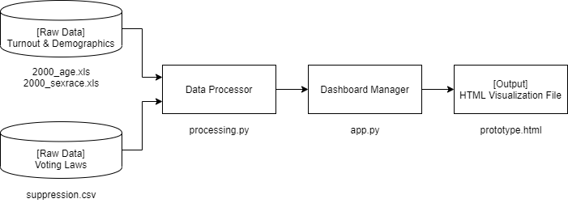

# Component Specification

## Software Components

### Raw Data
- Functions: 
    - accumulate all streams of election and demographic data, for all intended years
- Input: 
    - all unchanged .CSV files from MIT and the Census Bureau
- Output: 
    - all .CSV files, renamed for clarity and organization
### Data Processor
- Functions: 
    - load raw data
    - handle malformed values
    - merge legislative and demographic data by year and state
    - aggregate age and demographic data, perform joins with legislative data 
- Input: 
    - all labeled .CSV files
- Output: 
    - processed .CSV file
### Dashboard Manager
- Functions: 
    - generate Altair map views based on filters and joins
    - transmit rendered Altair visualization to output HTML file
- Input: 
    - modeled data as pandas.DataFrame or numpy.ndarray
- Output: 
    - Altair visualization (Python objects, functions, and code) 
### Output
- Input: 
    - user commands and interactions
- Output: 
    - live, updated version of same HTML file 

## Interactions [TO BE REVISITED]
1. User changes 'year' value using visualization controls on browser.
    - Browser sends changed settings of interactive map to Map Manager
    - Map Manager retrieves modeled dataset from Modeling
    - Map Manager filters data to the desired year
    - Map Manager returns bokeh visualization for the changed settings
    - Browser updates visualization with new bokeh view
    
2. User selects a specific state using visualization controls on browser.
    - Browser sends changed settings of interactive map to Map Manager
    - Map Manager retrieves modeled dataset from Modeling
    - Map Manager filters data to desired state/cluster and year 
    - Map Manager returns bvisualization with state/cluster highlighted and accompanying anecdotes
    - Browser updates visualization with new bokeh view

## Preliminary Plan 
1. Create and organize desired package structure in repository
2. Incorporate Git CI and test functionality
3. Write scripts to appropriately process and combine data
4. Write scripts to model and categorize data entries
5. Develop template for bokeh map visualization (with interactive features)
6. Write scripts to simplify installation and launch of visualization
7. Revisit model performance and add write-ups, time permitting
